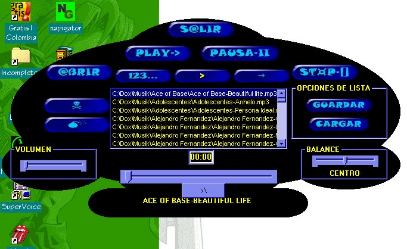



## Yova's MP3 Player

### Description

[ESPAÑOL]

Este es un reproductor de mp3's y wavs TIENE GRANDES IMPROVISACIONES COMO GUARDAR Y ABRIR LISTAS DEREPRODUCCION, BUSCAR, BUSQUEDA EN SUBDIRECTORIOS, Y MUCHO MAS VOTA POR MI SI APRENDES ALGO DE ESTE PRINCIPIANTE!

[ENGLISH]

THIS IS A MP3'S AND WAV PLAYER IT CAN SAVE AND LOAD PLAYLISTS, SEARCH , INCLUDE SUBDIRECTORIES IN YOUR DIRECTORIES LOADS, AND MANY MORE THINGS, PLEASE VOTE FOR ME IF YOY LEARN SOMETHING NEW FROM THIS BEGINNER!
 
### More Info
 

             |
---                |---
**Submitted On**   |2000-07-10 21:26:36
**By**             |[Geovany Andres Villegas](https://github.com/Planet-Source-Code/PSCIndex/blob/master/ByAuthor/geovany-andres-villegas.md)
**Level**          |Intermediate
**User Rating**    |3.8 (15 globes from 4 users)
**Compatibility**  |VB 3\.0, VB 4\.0 \(16\-bit\), VB 4\.0 \(32\-bit\), VB 5\.0, VB 6\.0, VB Script, ASP \(Active Server Pages\) 
**Category**       |[Sound/MP3](https://github.com/Planet-Source-Code/PSCIndex/blob/master/ByCategory/sound-mp3__1-45.md)
**World**          |[Visual Basic](https://github.com/Planet-Source-Code/PSCIndex/blob/master/ByWorld/visual-basic.md)
**Archive File**   |[CODE\_UPLOAD76697112000\.zip](https://github.com/Planet-Source-Code/geovany-andres-villegas-yova-s-mp3-player__1-9664/archive/master.zip)

